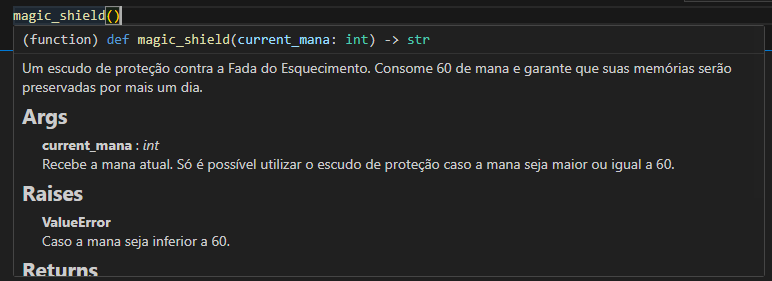

Por que utilizar Docstrings? Daqui alguns meses, quando precisar revisitar a função que você escreveu, descobrirá a resposta.

Uma função escrita hoje em dia parecerá óbvia para você, que saberá de cabo a rabo o que ela retorna, como é utilizada e onde. Existe, porém, uma entidade maligna conhecida como "**Fada do Esquecimento**". 

Essa fada surge enquanto dormimos e utiliza uma técnica proibida conhecida como "Mugic" para limpar nosso cérebro, em específico a região do Hipocampo, apagando todas as nossas memórias. Então, somos visitados pela fada e, no dia seguinte, quando vamos mexer no código... Esquecemos o que ele faz.

Infelizmente, não há um jeito de destruir a fada, ela sempre conseguirá deturpar nossas memórias ao longo do tempo. O melhor jeito de lidar com isso é justamente utilizando Docstrings, para documentar no próprio código tudo que nossas funções e métodos recebem, retornam, os erros possíveis e dar exemplos de uso, para que outras pessoas saibam como utilizá-los no código, e no futuro você mesmo possa usar, caso se esqueça.

# O que são Docstrings?
Docstrings são, literalmente, Strings. Strings que você utiliza logo após a definição da função ou método para documentá-la. Veja o exemplo abaixo:
```python
def magic_shield(current_mana: int) -> str:
    """
    Um escudo de proteção contra a Fada do Esquecimento.
    Consome 60 de mana e garante que suas memórias serão preservadas por mais um dia.

    Args:
        current_mana (int): Recebe a mana atual. Só é possível utilizar o escudo 
                            de proteção caso a mana seja maior ou igual a 60.

    Raises:
        ValueError: Caso a mana seja inferior a 60.

    Returns:
        str: Retorna o feitiço de invocação do escudo.
    
    Examples:
        print(magic_shield(80))  # Retorna "Utamo Vita!!!"
        print(magic_shield(40))  # Levanta ValueError

    """
    if current_mana >= 60:
        return "Utamo Vita!!!"
    
    raise ValueError(f"Mana atual é de {current_mana}. Impossível usar a magia.")
```
Tão simples que chega a ser ridículo. O tipo de coisa que você escreve em dois minutos e pode poupar horas de análise no futuro. Caso no futuro você esqueça a implementação da função, pode utilizar o comando `help()` para verificar a Docstring. Veja abaixo:
```python
help(magic_shield)
```
E a saída será:
```text
Help on function magic_shield in module __main__:

magic_shield(current_mana: int) -> str
    Um escudo de proteção contra a Fada do Esquecimento.
    Consome 60 de mana e garante que suas memórias serão preservadas por mais um dia.

    Args:
        current_mana (int): Recebe a mana atual. Só é possível utilizar o escudo
                            de proteção caso a mana seja maior ou igual a 60.

    Raises:
        ValueError: Caso a mana seja inferior a 60.

    Returns:
        str: Retorna o feitiço de invocação do escudo.

    Examples:
        print(magic_shield(80))  # Retorna "Utamo Vita!!!"
        print(magic_shield(40))  # Levanta ValueError
```
E caso esteja usando PyCharm, Visual Studio Code ou alguma outra IDE poderosa, Docstrings se tornam **AINDA MAIS** poderosas, já que você pode posicionar o cursor sobre a função e será exibida uma janela Pop-Up com sua Docstring.
<p align="center">  <br> <em>É útil, mas lembre-se que lendas da programação não usam o mouse.</em> </p>

## Outros Tópicos dentro de Docstrings
A esmagadora maioria das Docstrings contará com Args, Raises, Examples e Returns. Apesar disso, existem outros tópicos que podem ser encaixados nela. Eles são:
- **Attributes**: Para classes
- **Yields**: Para funções geradoras
- **Warns**: Para avisos
- **Notes**: Para notas importantes
- **See Also**: Para adicionar referências cruzadas
- **References**: Para citações acadêmicas
- **Deprecated**: Para funções obsoletas
- **Todo**: Para indicar funcionalidades futuras
- **Version**: Para controle de versão

# Sphinx e Modelos de Docstrings
O padrão utilizado no exemplo mostrado acima foi o padrão Google, porém, existem outros padrões bem utilizados no mercado para que possamos documentar nossas funções com Docstrings. Outro padrão muito comum é o padrão NumPy/SciPy, utilizado geralmente para projetos bem estruturados de dados. Um exemplo pode ser visto abaixo:
```python
def magic_shield(current_mana: int) -> str:
    """
    Um escudo de proteção contra a Fada do Esquecimento.

    Consome 60 de mana e garante que suas memórias serão preservadas por 
    mais um dia.

    Parameters
    ----------
    current_mana : int
        Recebe a mana atual. Só é possível utilizar o escudo de proteção 
        caso a mana seja maior ou igual a 60.

    Returns
    -------
    str
        Retorna o feitiço de invocação do escudo.

    Raises
    ------
    ValueError
        Caso a mana seja inferior a 60.

    Examples
    --------
    >>> magic_shield(80)
    'Utamo Vita!!!'
    >>> magic_shield(40)
    Traceback (most recent call last):
        ...
    ValueError: Mana atual é de 40. Impossível usar a magia.
    """
    if current_mana >= 60:
        return "Utamo Vita!!!"
    
    raise ValueError(f"Mana atual é de {current_mana}. Impossível usar a magia.")
```
E temos também o reStruturedText (Apelidado carinhosamente de reST), que é o utilizado em documentações oficiais do Python.  Veja a seguir:
```python
def magic_shield(current_mana: int) -> str:
    """
    Um escudo de proteção contra a Fada do Esquecimento.

    Consome 60 de mana e garante que suas memórias serão preservadas por 
    mais um dia.

    :param current_mana: Recebe a mana atual. Só é possível utilizar o 
        escudo de proteção caso a mana seja maior ou igual a 60.
    :type current_mana: int
    :return: Retorna o feitiço de invocação do escudo.
    :rtype: str
    :raises ValueError: Caso a mana seja inferior a 60.

    .. rubric:: Examples

    >>> magic_shield(80)
    'Utamo Vita!!!'
    """
    if current_mana >= 60:
        return "Utamo Vita!!!"
    
    raise ValueError(f"Mana atual é de {current_mana}. Impossível usar a magia.")
```
Todos são válidos e funcionais. Qual você deve usar depende puramente de convenções ou se alguém definiu que deve ser assim. Ademais... o reST é o padrão ouro para ser utilizado com Sphinx, mas hoje em dia qualquer formato de Docstring funciona caso utiliza a extensão oficial `sphinx.ext.napoleon`. Por isso, dica da tia: Utilize o padrão que te deixa mais confortável, salvo se houver alguma convenção definida pela equipe.

## Mas o que é Sphinx?
Sphinx é uma poderosa ferramenta que transforma todas as suas Docstrings em código HTML. Você pode instalá-la utilizando `pip install sphinx` e ao rodar `sphinx-quickstart` no console, o Sphinx irá criar todos os arquivos de configuração necessários.  
Escreva suas Docstrings e códigos normalmente. Quando quiser documentar, basta utilizar `sphinx-apidoc -o source .` e `make html` no terminal e o Sphinx lerá **TUDO** que foi feito e criará um site bonitinho com sua documentação.

Veja o site oficial do Python: [3.14.2 Documentation](https://docs.python.org/3/)  
Ele foi completamente feito com Sphinx.

Lindo, não?

### Dica de Platina
Ao utilizar `sphinx-quickstart` no terminal, verá que surgirão novas pastas e arquivos. Eles são os arquivos para configurar o Sphinx. Procure pelo arquivo `conf.py` e encontrará algo parecido com isso:
```python
extensions = []
```
Modifique, adicionando esse bloco de código:
```python
import os
import sys

sys.path.insert(0, os.path.abspath('..'))

extensions = [
    'sphinx.ext.autodoc',
    'sphinx.ext.napoleon',
    'sphinx.ext.viewcode',
]
napoleon_google_docstring = True
# napoleon_numpy_docstring = True
```
Agora ele será capaz de ler Docstrings automaticamente, mostrará o código fonte e suportará outros formatos além do reST.  
Note também que a linha `napoleon_numpy_docstring = True` está comentada. Caso esteja utilizando o modelo de documentação do NumPy, utilize ela, caso esteja utilizando o do Google, utilize `napoleon_google_docstring = True`.
A importação das bibliotecas e definição do Path servem para que o Sphinx leia onde estão seus códigos. o '..' indica que os códigos estão uma pasta acima, mas caso estejam dentro de uma pasta específica, você deve modificar para que o Path corresponda à localização de seus códigos.

## Dica de Diamante
O comando `make html` só é funcional em ambientes baseados em Unix, logo, dificilmente funcionará no Windows. Apesar disso, note que o Sphinx gerou um arquivo chamado `make.bat`. Execute-o no console com `.\make.bat html` e assim terá o Sphinx rodando no Windows.

No Linux é sempre mais fácil... Já pensou em migrar?

## Fluxo completo de Documentação
Caso tenha se perdido, aqui um guia completo para gerar sua documentação via Sphinx.

```bash
# 1. Instalar
pip install sphinx

# 2. Configurar
sphinx-quickstart # Responda as perguntas que surgirão, como nome, data, etc.

# 3. Configurar conf.py

# 4. Gerar documentação
sphinx-apidoc -o source .   # Gera arquivos .rst
make html                   # No Linux e Mac
.\make.bat html             # No Windows

# 5. Abrir
open build/html/index.html  # No Mac
start build/html/index.html # No Windows
xdg-open build/html/index.html  # No Linux
```

Sempre documente seus códigos! Eles são sua proteção contra a Fada do Esquecimento e um sinal elevado de maturidade computacional.  
Aliás, já que terminou de ler sobre Docstrings, que tal ler sobre [Documentações Orgásmicas](DocumentacoesOrgasmicas.md)?